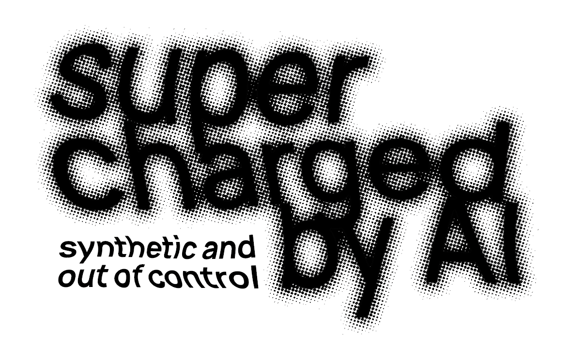
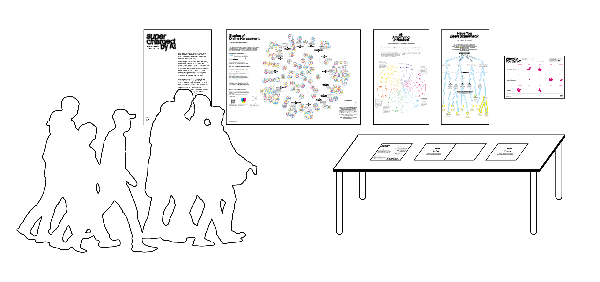
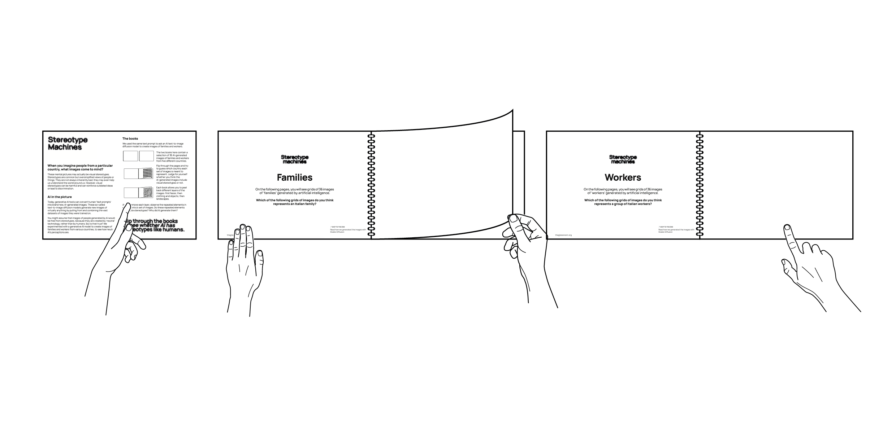
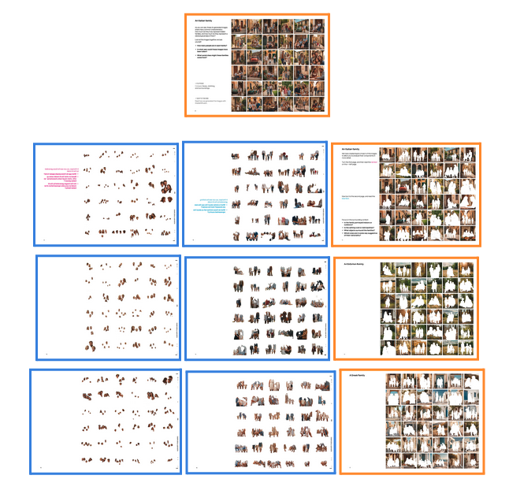
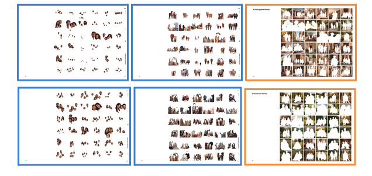
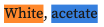
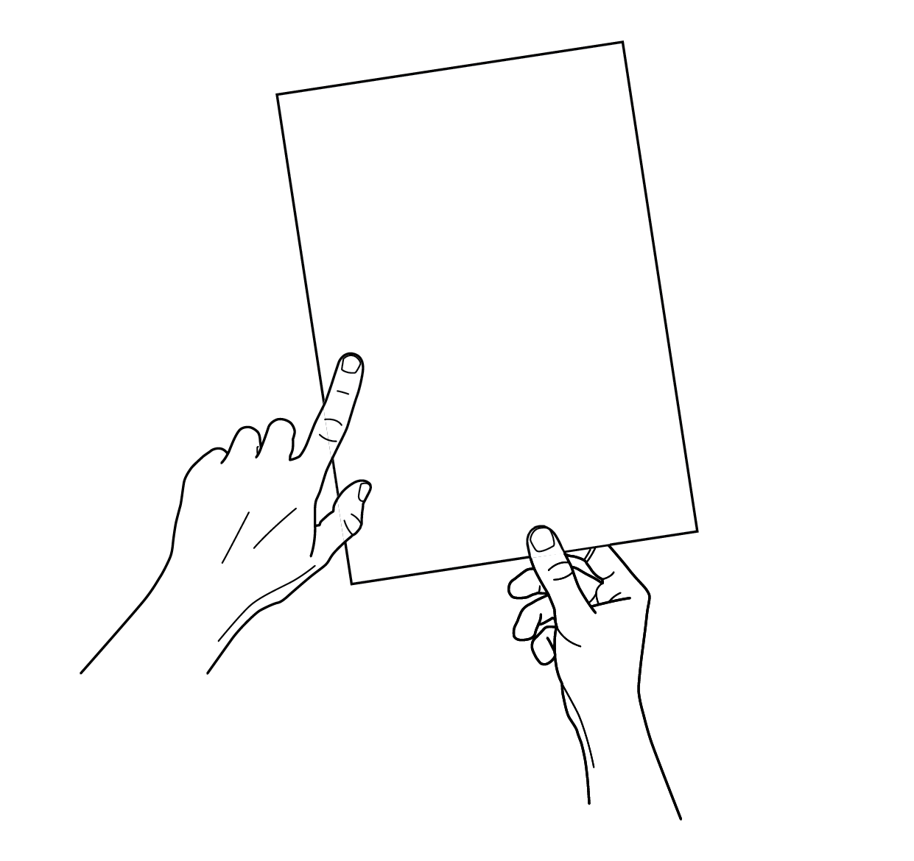
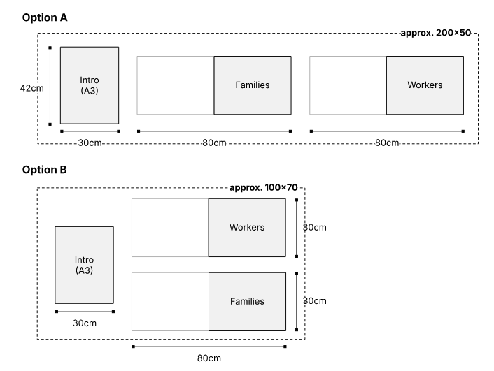

# Supercharged by AI

"Supercharged by AI" is a new creative intervention produced by Tactical Tech and
DensityDesign Lab at Politecnico di Milano, in collaboration with the
International Federation of Library Associations and Institutions (IFLA).

This exhibition addresses how AI is impacting the ways that media and
information is produced, distributed, and perceived. It is presented by The
Glass Room, an award-winning project by Tactical Tech that raises awareness
through playful and provocative explorations of our relationship to technology.

"Supercharged by AI" is an easy-to-produce, large-scale display that can be
presented in libraries, community centres, universities, festivals, and museums.
It contains engaging resources including 3 visualisations, 2 books, an
interactive poster, and a detailed set-up guide that make complex issues related
to AI more tangible for visitors.

Project website: http://www.theglassroom.org/supercharged-by-ai
Contact:
events@tacticaltech.org
info@densitydesign.org

## Repository structure

Each language has its own folder (e.g., `English`, `Italian`). The file names are
the same for each language, with the language code prefix.

Example (English):

- `en - 0 - Introduction.pdf`
- `en - 1 - Online Harassment.pdf`
- `en - 2.1 - Stereotype Machines (Intro).pdf`
- `en - 2.2 - Stereotype Machines (Workers book).pdf`
- `en - 2.3 - Stereotype Machines (Families book).pdf`
- `en - 3 - Political Influences.pdf`
- `en - 4 - Scams.pdf`
- `en - 5 - Outro Spectrogram.pdf`
- `en - 6 - Data Detox Kit.pdf`

## Set-up manual

### What the exhibition includes

5 posters:

- Introduction poster — A poster explaining the theme of the exhibition
  (A0 or 841 x 1189 mm).
- Stories of Online Harassment — A poster depicting 100 stories of online
  harassment, and the people, places, and motives behind them
  (2A0 or 1682 x 1189 mm).
  - Lens App: Visitors should access `https://lens.theglassroom.org` on their
    smartphone or tablet to explore the poster.
- Have You Been Scammed? — A poster calling attention to online scams, and how
  they can be supercharged by AI (594 x 1189 mm).
- AI: Amplifying Influence — A poster introducing the methods and tools of the
  AI-powered political influence industry (695 x 1189 mm).
- What do you think? — An interactive poster where visitors can anonymously
  respond to questions about how they feel AI is affecting their lives
  (A1 or 594 x 841 mm).

2 books (Stereotype Machines):

- Stereotype Machines — A mini-poster and two books that visitors can flip
  through to explore stereotypes of families and workers from different
  countries embedded in AI tools. Each book is 24 pages, A3, bound.
- Families — Images of families generated by an AI image generator.
- Workers — Images of workers generated by an AI image generator.

1 printed guide for visitors:

- Data Detox Kit: Essential Guide to AI — A guide for visitors to take home.
  This Data Detox dives deeper into the topics presented in the exhibition,
  giving visitors practical tips and thought-provoking questions about how AI
  supercharges scams, online harassment, political influence, and bias (A4).

### Host requirements

Space and furniture:

- Wall space to hang 5 posters of at least 5.03 sqm (54.16 sq ft) total.
- A table to display Stereotype Machines:
  - Option A: approx. 100 x 70 cm.
  - Option B: approx. 200 x 50 cm.
    
- A table or other place to provide Data Detox Kits.

Other materials:

- 2 metallic spirals, at least 15 mm diameter, to bind the books (the printer
  should assemble the books for you).
- Coloured stickers (dots or other shape), size: 12-18 mm.
- Double-sided tape to mount the exhibition on the wall.
- Optional tablets for visitors to explore "Stories of Online Harassment".
- Wi-Fi for visitors (if possible), to access the Lens App.

### How to print "Supercharged by AI"

Posters (white paper, 140 gsm, colour print):

| Size                 | Item                         | Print specs                  |
| -------------------- | ---------------------------- | ---------------------------- |
| 841 x 1189 mm (A0)   | Intro Poster                 | White paper, 140 gsm, colour |
| 1682 x 1189 mm (2A0) | Stories of Online Harassment | White paper, 140 gsm, colour |
| 695 x 1189 mm        | AI: Amplifying Influence     | White paper, 140 gsm, colour |
| 594 x 1189 mm        | Have You Been Scammed?       | White paper, 140 gsm, colour |
| 594 x 841 mm (A1)    | What Do You Think?           | White paper, 140 gsm, colour |

Note: If any posters require special printing (e.g., plotter), add details here.

Stereotype Machines (mini-poster and books):

- You will receive two files per book: one for white paper and one for acetate
  (transparent) paper.
- The printer should assemble the books using a silver metallic spiral, at
  least 15 mm diameter.

| Size | Item                                   | Print specs for white paper                             | Print specs for transparent paper                |
| ---- | -------------------------------------- | ------------------------------------------------------- | ------------------------------------------------ |
| A3   | Stereotype Machines: Intro Mini-Poster | 300 gsm, white paper                                    | --                                               |
| A3   | Stereotype Machines: Families Book     | 14 pages, 300 gsm, white paper, colour, front side only | 10 pages, acetate paper, colour, front side only |
| A3   | Stereotype Machines: Workers Book      | 14 pages, 300 gsm, white paper, colour, front side only | 10 pages, acetate paper, colour, front side only |

Data Detox Kit:

| Size | Item                  | Print specs                       | Notes                          |
| ---- | --------------------- | --------------------------------- | ------------------------------ |
| A4   | Essential Guide to AI | White paper, colour, double-sided | Fold in half to form a booklet |

### How to assemble the "Stereotype Machines" books (for the printer)

Step 1: Have all your elements.
For each book (Workers and Families), you should have:

- 14 white pages and 10 transparent acetate pages.
- One book binding ring (silver metallic), minimum 15 mm diameter.

Step 2: Assemble the books.
Please assemble the books based on the numbering system. Each book has four
parts:

- Cover (page 1) — white paper.
- Guessing Game (pages 2-7) — white paper.
- Stereotype Deconstruction (pages 8-23) — mixes white and acetate paper.
  Pages 9 and 10 will appear with backwards text. This is intentional; the text
  is read when the page is turned to the other side.
- Methodology (page 24) — white paper.

### How to exhibit "Supercharged by AI"

On the wall (left to right):

- Introduction Poster -> Stories of Online Harassment -> Have You Been Scammed?
  -> AI: Amplifying Influence -> What Do You Think?
- Below "What Do You Think?", hang packs of coloured stickers.

On a larger table (left to right):

- Introduction placard -> Stereotype Machines: Families book -> Stereotype
  Machines: Workers book -> Conclusion placard.

On a small table at the end of the exhibition:

- Place the Data Detox Kit Essential Guide to AI.

### Feedback and open questions

- Is anything missing or still unclear?
- Do we need to include instructions for the web app beyond the link (already on
  the Online Harassment poster)?
- Data Detox Kits placement: recommended on a separate small table (not the same
  as Stereotype Machines).

## License

All materials are released under the Creative Commons Attribution 4.0
International License (CC BY 4.0). See `LICENSE`.
